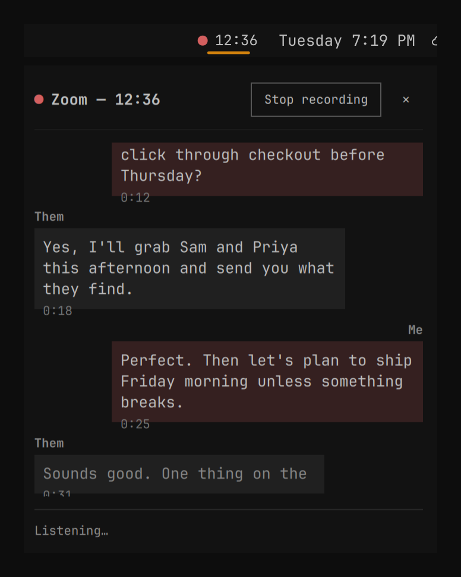

# Spitball

An [Omarchy](https://omarchy.org) bar plugin that records your calls, transcribes
both sides, and writes a summary — without you starting anything.

Spitball watches the microphone. When a call app opens it, an amber record button
appears in the bar. Click it and choose **Start recording** (or turn on auto-record) and
Spitball captures the call,
stops on its own when the call ends, and leaves you a transcript and a summary in
`~/Calls/`.



## What it does

1. **Detects.** A `pactl`-based watcher notices when Zoom, Chrome, Chromium, Brave,
   Firefox (including Google Meet running in any of those), Slack, Teams, Discord,
   Signal, Webex, or WhatsApp opens the microphone.

2. **Shows it in the bar.** The record button sits in the bar's center section, just
   left of the indicators. It stays hidden, like an inactive indicator, until you
   hover the section, except while a call is detected, recording, processing, or
   erroring, when it's always visible: amber for a detected call, a red dot with a
   running timer while recording.

3. **Records stereo Opus.** Left channel is your default microphone; right channel is
   whatever's playing through your default speakers or headphones. Keeping the two
   sides on separate channels is what lets the transcriber tell your voice from
   everyone else's without guessing.

4. **Stops on its own.** About 8 seconds after the call app releases the mic,
   recording stops and processing starts. A recording under 60 seconds (10 for a
   manual start) gets discarded, on the theory that it's a Slack huddle you clicked
   out of, not a call.

5. **Transcribes.** By default, on-device with [voxtype](https://voxtype.io) (ships
   with Omarchy) — audio never leaves your machine. Switch to Deepgram
   (`nova-3`, multichannel, diarized) for cloud transcription instead. See
   [Transcription providers](#transcription-providers) below.

6. **Summarizes.** The transcript goes to any OpenAI-compatible chat endpoint (a
   local Ollama by default) for a title, summary, decisions, and action items. No
   model configured or reachable just means a transcript instead of a summary;
   `spitball reprocess <dir>` fills the summary in later.

Any click on the widget, left or right, opens its menu: start recording, show the
live transcript and stop while recording, dismiss the current detection, toggle
auto-record, open the last call's summary, open the calls folder, or open Settings.
A click never stops a call by itself; Stop is always an explicit menu item or the
Live popup's button. Settings and the Live popup each have a ✕ in their header to
close them. When something needs attention before Spitball can transcribe (no
Deepgram key, no local dictation installed), the widget shows a small "Set up" gear
even while idle, and its menu leads with **Set up transcription…**. Switching the local model from Settings (see
[Transcription providers](#transcription-providers)) shows the same way: a small
download glyph while it runs, with the percentage in its tooltip.

## Live transcript

Starting a recording from the menu opens the **Live popup**, and **Show live
transcript** in the menu reopens it while recording: a chat-style transcript that fills
in as you talk, plus a **Stop recording** button and a ✕ that closes the popup while
the recording keeps going. Your lines sit
on the right, the other side's on the left, each with a small timestamp. It's powered
by a background live transcriber that runs on-device with voxtype regardless of
`transcription_provider` (see [Configuration](#configuration)'s `live_transcript` and
`live_max_window_s`) — it never costs money or sends audio anywhere mid-call, and
turning it off (`live_transcript: false`) just means the popup shows why it isn't
available instead of a transcript.

**Fast live engine.** Out of the box each line is one `voxtype transcribe` run, which
reloads the model every time, so lines land several seconds after each pause. Run
`spitball live setup` once to install a small venv (onnx-asr + onnxruntime, about
130 MB, under `~/.local/share/spitball/live-engine/`) that keeps voxtype's Parakeet
model loaded for the whole call. The popup then shows the sentence as it's spoken,
dimmed, trailing the speaker by well under a second, and locks it in about a second
after the pause. It uses whichever Parakeet model voxtype is set to (the streaming
`parakeet-unified-en-0.6b` included) and needs roughly that model's size in extra
memory during a call. `spitball live status` says whether it's on; if the engine
isn't installed, voxtype is on Whisper, or the worker fails, the live transcript
falls back to the voxtype path on its own. Once you stop, the popup shows "Recording saved;
transcribing…" briefly and closes on its own (or click ✕). If
`transcription_provider` is `local`, the finished live transcript is reused instead of
transcribing the whole call again — a normal full transcription still runs if it came
out too thin or too many parts failed. See CONTRACT.md for the full `live.json`/
`.live.json` file formats.

## Install

```bash
omarchy plugin add https://github.com/supercleanse/spitball --enable
```

Run interactively, `--enable` asks which bar section to use and defaults to center,
which puts Spitball immediately left of `omarchy.indicators`. Run non-interactively
(scripted, or with `--yes`), it lands in center without asking. To install without
enabling, drop `--enable` and run `omarchy plugin enable supercleanse.spitball`
later. To choose exactly where it sits:

```bash
omarchy plugin enable supercleanse.spitball --section center --before omarchy.indicators
```

See `omarchy plugin enable --help` for the full set of placement flags.

Then set a Deepgram key (see [Configuration](#configuration)) and, if you want
summaries, have something OpenAI-compatible listening — a local Ollama at
`127.0.0.1:11434` needs no configuration at all.

### Update

```bash
omarchy plugin update supercleanse.spitball
```

### Remove

```bash
omarchy plugin remove supercleanse.spitball
```

That removes the plugin itself. Spitball's own settings, state, and the optional
live-engine venv stay behind until you delete them:

```bash
rm -rf ~/.config/spitball ~/.local/state/spitball ~/.local/share/spitball
```

Your recorded calls (`~/Calls/` by default) are never touched. If you let Spitball
switch voxtype's model, voxtype keeps that model; change it back with `voxtype setup`.

### Restart the daemon

```bash
omarchy-shell supercleanse.spitball restart
```

Useful after editing `~/.config/spitball/config.json`, or if the daemon's gotten into
a bad state.

## What it needs

Already on a stock Omarchy install: `python3`, `ffmpeg`, `pactl` (part of
`libpulse`), `notify-send`, and [voxtype](https://voxtype.io) (Omarchy's own
dictation tool — Spitball's default transcription provider runs on it, on-device,
with no key and no setup). Spitball's own code is Python standard library only and
runs on the system `python3`, with no `pip install` needed.

Optional, for the fast live transcript: `spitball live setup` creates a small
virtualenv at `~/.local/share/spitball/live-engine/venv` (about 130 MB) and installs
[onnx-asr](https://github.com/istupakov/onnx-asr), onnxruntime, numpy, and
sentencepiece into it from PyPI. It uses [uv](https://docs.astral.sh/uv/) when it's
on your PATH, otherwise `python3 -m venv` and pip. Nothing outside that folder is
installed, and deleting the folder removes it. Without it, the live transcript still
works, just a few seconds slower (see [Live transcript](#live-transcript)).

Switching voxtype between its Whisper and Parakeet engines from Settings asks for
your password (a graphical `pkexec` prompt, or `sudo` in a terminal as a fallback),
because voxtype's own `voxtype setup onnx` needs root. Spitball then restarts the
voxtype user service (`systemctl --user restart voxtype`). Nothing else Spitball does
needs elevated rights.

Want cloud transcription instead? Switch `transcription_provider` to `deepgram`
and set a **Deepgram API key** — new accounts get free credit to start, and
`nova-3` prerecorded transcription runs at roughly $0.26/hour at the time of
writing. See [Deepgram's pricing](https://deepgram.com/pricing) for current rates,
and [Transcription providers](#transcription-providers) below.

Summaries are optional and need one more thing: something speaking the OpenAI chat
API. A local [Ollama](https://ollama.com) works out of the box at its default port;
LM Studio, OpenAI, and OpenRouter all work too (see `summary_base_url` below).

## Files per call

Each call gets its own folder, `~/Calls/<YYYY-MM-DD-HHMM>-<app>-<title-slug>/`:

| File | Contents |
|---|---|
| `audio.opus` | The stereo recording (left = you, right = the room). |
| `transcript.md` | Full transcript, speaker-labeled and timestamped. |
| `summary.md` | Title, summary, decisions, action items, open questions. |

The folder isn't named with a title until processing finishes — it starts as
`<timestamp>-<app>` and gets a slug of the generated title appended once transcription
and summarization are done.

Set `export_dir` and Spitball also copies the summary and full transcript, as one
markdown file, into that folder — handy for dropping calls straight into an Obsidian
vault or a notes tool.

## Transcription providers

Set `transcription_provider` to pick one:

- **`local`** (default) — runs on voxtype, on-device, no key needed. Spitball never
  manages voxtype's model or engine choice itself; it just runs whatever you already
  have voxtype configured with (Whisper `base.en` out of the box on Omarchy, or
  Parakeet if you've picked it in voxtype's own setup). `spitball local info` shows
  what's active; `spitball local models` lists every model voxtype knows how to
  download with size/language/installed info.

  The Settings popup's Local section has one Model dropdown, with **Parakeet
  (unified, English)** marked Recommended. It's the one streaming-capable model:
  switching to it also turns on voxtype's `parakeet.streaming`, so dictation
  types while you talk instead of after you stop, and writes the streaming
  window sizes voxtype needs into its `[parakeet]` config. Switching to any
  other Parakeet model turns streaming back off. Language coverage varies by
  model:
  - **Parakeet (unified, English)** (recommended) — English only, about 2.4 GB.
  - **Parakeet v3** (and its int8 variant) — 25 European languages.
  - **Parakeet v2** (and its int8 variant) — English only.
  - **Whisper** multilingual models (the plain `tiny`/`base`/`small`/`medium`/
    `large-v3`/`large-v3-turbo`, without a `.en` suffix) — around 99 languages;
    the `.en` variants are English-only and slightly more accurate for it.

  Picking a different model in the dropdown shows an inline confirmation
  ("Switch to Parakeet v3 (int8)? Downloads about 640 MB and asks for your
  password once. Also changes Omarchy dictation.") — nothing switches until you
  click **Switch**. `spitball local set-model <name>` (what that button calls)
  then runs the whole switch **in the background**: it never blocks, and its
  progress (`$XDG_RUNTIME_DIR/spitball/model.json`, see CONTRACT.md) shows both
  in the popup, if you reopen it, and as a small download glyph on the bar
  widget itself while it runs. Normally there's no terminal at all — just
  Omarchy's own graphical password prompt if the engine needs to change (e.g.
  Whisper → Parakeet), then a background download. It only opens a floating
  terminal (the original, fully interactive approach) as a fallback, when
  there's no way to draw that graphical prompt at all. Either way, Spitball's
  own process never runs `sudo`/`pkexec` itself or edits voxtype's config
  directly. If voxtype isn't installed at all, the bar shows a "Set up" gear
  with a hint to install it or switch providers.
- **`deepgram`** — cloud, multichannel + diarized, so the far side can have several
  distinct speakers. See `deepgram_model`/`deepgram_api_key(_command)` below.

More providers (an OpenAI-compatible endpoint, AssemblyAI, Soniox) are planned —
see `docs/ROADMAP.md`.

Every provider transcribes into the same shape, cached as `.transcript.json` in the
call folder so `spitball reprocess <dir>` doesn't re-transcribe unless you pass
`--retranscribe`. `language` picks the spoken language: `"en"` (default), `"auto"`
(provider-dependent detection), or an ISO code.

## Configuration

Settings live in `~/.config/spitball/config.json`, an optional file — every key has a
default, and you only need to set the ones you want to change.

| Key | Default | Meaning |
|---|---|---|
| `calls_dir` | `~/Calls` | Where finished call folders go. |
| `export_dir` | `""` | Also copy each call's summary + transcript as one markdown file here. Empty means off. |
| `my_name` | your account's first name | The label used for your channel in the transcript and summary. |
| `auto_record` | `false` | Start recording automatically the moment a call is detected. Same setting `spitball auto on\|off\|toggle` flips. |
| `language` | `"en"` | Spoken language: an ISO code, or `"auto"` for provider-dependent detection (deepgram: its own language-detection mode; local: whatever voxtype's active model supports). |
| `transcription_provider` | `"local"` | `"local"` (voxtype, on-device) or `"deepgram"` (cloud). See [Transcription providers](#transcription-providers). |
| `deepgram_api_key` | `""` | Your Deepgram API key, in plain text. |
| `deepgram_api_key_command` | `""` | A shell command whose stdout is the key, for a password manager, e.g. `op read op://Private/Deepgram/credential`. |
| `deepgram_model` | `nova-3` | Deepgram transcription model. |
| `summary_base_url` | `http://127.0.0.1:11434/v1` | Any OpenAI-compatible chat endpoint. |
| `summary_model` | `""` | Model name to request. Empty means the first model the endpoint lists. |
| `summary_api_key` | `""` | API key for `summary_base_url`, in plain text. |
| `summary_api_key_command` | `""` | A shell command whose stdout is that key, same idea as `deepgram_api_key_command`. |
| `summary_enabled` | `true` | Turn summarization off entirely and keep transcripts only. |
| `call_apps` | Zoom, Chrome, Chromium, Brave, Firefox, Slack, Teams, Discord, Signal, Webex, WhatsApp | Mic users that count as a call, matched case-insensitively against the process name; each key maps to a display name shown in the bar. |
| `live_transcript` | `true` | Show a live, chat-style transcript in the bar's Live popup while recording (see [Live transcript](#live-transcript)). Always uses the local provider, regardless of `transcription_provider` -- it never costs money or sends audio anywhere mid-call. |
| `live_max_window_s` | `12` | A live segment with no pause yet is cut here regardless, so one long uninterrupted stretch of talk still shows a line before the call ends. |
| `live_engine` | `true` | Use the fast live engine once `spitball live setup` has installed it (see [Live transcript](#live-transcript)). `false` goes back to one `voxtype transcribe` per line. |
| `detect_after_s` | `2` | Seconds the mic must stay open before a call counts as detected. |
| `end_after_s` | `8` | Seconds the app must be gone before a call counts as ended (rides out brief device switches). |
| `min_call_s` | `60` | Discard an auto-detected recording shorter than this. |
| `min_manual_s` | `10` | Discard a manually-started recording shorter than this. |
| `opus_bitrate` | `32k` | ffmpeg's Opus encoding bitrate. |

The Deepgram key can also come from the `DEEPGRAM_API_KEY` environment variable,
which wins over both config keys — useful if you'd rather manage it outside the
config file entirely. Same idea for `summary_api_key`, via `summary_api_key_command`.

You can edit `config.json` by hand (restart the daemon afterward — see
[Restart the daemon](#restart-the-daemon)), or through `spitball config`:

```bash
spitball config get --json                       # effective settings; *_api_key values are masked
spitball config set my_name Morgan
spitball config set transcription_provider deepgram
echo -n "your-deepgram-key" | spitball config set-secret deepgram_api_key
spitball config unset export_dir                 # back to the default
```

`config set`/`set-secret`/`unset` write atomically, make `config.json` mode `600`
once it holds a secret, and reload the running daemon automatically (falls back to
nothing happening — no crash — if the daemon isn't up). `set` rejects unknown keys
and the secret keys themselves (`deepgram_api_key`, `summary_api_key`) — those go
through `set-secret`, which reads the value from stdin so it never lands in your
shell history or `ps` output.

`spitball check transcription --json` and `spitball check summary --json` test the
configured provider/endpoint for real (a live network call) and report `{"ok", "message"}`
(summary also lists `"models"`).

## Crash recovery

If the daemon dies mid-recording (the shell crashes, the session ends uncleanly), the
next start finds the orphaned `ffmpeg` process, stops it, and finishes that call's
`audio.opus` cleanly. It also walks `~/Calls/` for any folder that has audio
but no `summary.md` and picks up transcription and summarization where they left off.
Nothing you recorded gets lost to a bad restart.

## Privacy and consent

Audio never leaves your machine except for one upload: the finished recording goes to
Deepgram for transcription. That request sets `mip_opt_out=true`, which opts you out
of Deepgram's model-improvement program — see
[Deepgram's privacy policy](https://deepgram.com/privacy) for what they do with
submitted audio. The transcript then goes wherever `summary_base_url` points, which
is a local model on your own machine by default and stays there unless you point it
somewhere else.

Recording laws vary by place — some require only your own consent, others require
everyone on the call to consent. Check your jurisdiction, and tell people you're
recording.

## Troubleshooting

**Their side is missing from the recording.** Spitball records your default output
device's monitor. Check `pactl get-default-sink` — if it's pointed at a dock or
headset you've since unplugged, that's a silent monitor.

**No call gets detected.** Run `pactl list source-outputs` while the call is live and
look at the stream's `application.name` and `application.process.binary`. If the app
isn't there under a name Spitball recognizes, add it to `call_apps` in
`~/.config/spitball/config.json`.

**Is the daemon even running?**

```bash
spitball status
```

Logs come through `notify-send` for user-facing errors; for anything else, run the
daemon in a terminal (`python3 -I bin/spitball daemon`) to see its stderr directly.

**Recorder failed to start.** The daemon reads `ffmpeg`'s own log and surfaces its
last line as the error — usually a PipeWire device that's gone missing. Confirm both
`pactl get-default-source` and `pactl get-default-sink` return something.

**Echo on laptop speakers.** On built-in speakers, the mic also picks up the other
side's voice, so both channels partially repeat each other. Spitball filters
mic-channel text that overlaps far-side text in time and wording, but it isn't
perfect — headphones avoid the problem at the source and give Deepgram a cleaner
signal to diarize.

## CLI

`bin/spitball` is the plugin's own CLI. Symlink it onto your `PATH` for convenience:

```bash
ln -s ~/.config/omarchy/plugins/supercleanse.spitball/bin/spitball ~/.local/bin/spitball
```

| Command | Effect |
|---|---|
| `spitball start` | Start recording now: follows a detected call if one is live, else manual. |
| `spitball stop` | Stop recording; processing begins in the background. |
| `spitball toggle` | Start if idle, stop if recording. |
| `spitball dismiss` | Ignore the current detection (or clear an error) without recording. |
| `spitball auto on\|off\|toggle` | Set auto-record: start automatically the moment a call is detected. |
| `spitball open-last` | Open the last call's `summary.md`. |
| `spitball open-folder` | Open `~/Calls` in the file manager. |
| `spitball status [--json]` | Print the current state. |
| `spitball reprocess <call-dir> [--retranscribe]` | Redo transcription and summary for one call folder. `--retranscribe` ignores the cached transcript and calls the provider again. |
| `spitball config get\|set\|set-secret\|unset` | Read/edit settings. See [Configuration](#configuration). |
| `spitball check transcription\|summary [--json]` | Test the configured transcription provider or summary endpoint for real. |
| `spitball local info\|models\|set-model` | What voxtype is configured with, every model it can download, or switch it to one. See [Transcription providers](#transcription-providers). |
| `spitball live setup\|status [--json]` | Install the fast live-transcript engine, or show whether it's on and which model it loads. See [Live transcript](#live-transcript). |
| `spitball pick-folder [--title T]` | Native folder chooser; prints the chosen path (used by the settings panel). |
| `spitball daemon` | Run the service directly. `SpitballService.qml` does this for you; you shouldn't need to. |

Full state-file and CLI contract in [CONTRACT.md](CONTRACT.md).

## Development

The repository *is* the plugin — there's no separate build step. For live editing,
symlink it into place instead of using `omarchy plugin add`:

```bash
ln -s /path/to/spitball ~/.config/omarchy/plugins/supercleanse.spitball
omarchy-shell shell rescanPlugins
```

After changing Python (`spitball/*.py`, `bin/spitball`), restart just the daemon:

```bash
omarchy-shell supercleanse.spitball restart
```

After changing QML (`Widget.qml`, `SpitballService.qml`), restart the shell:

```bash
omarchy restart shell
```

Tests run through `tests/run.sh`; pass `--live` to include anything that talks to a
real system (PipeWire, an actual model endpoint) instead of just fixtures.

## License

MIT. See [LICENSE](LICENSE).
